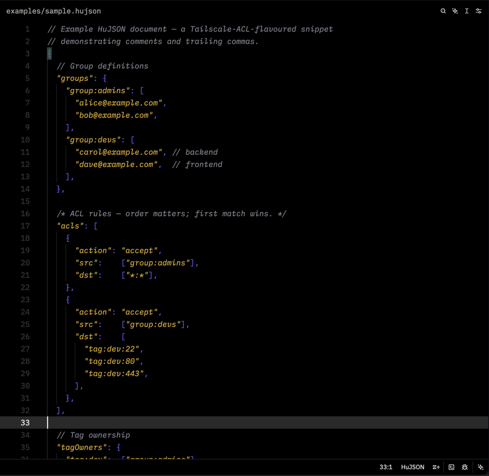

# HuJSON for Zed

<p align="center">
  <a href="https://github.com/ggfevans/zed-hujson/actions/workflows/ci.yml"></a>
  <a href="https://github.com/ggfevans/zed-hujson/releases/latest"></a>
  <a href="https://github.com/ggfevans/tree-sitter-hujson/releases/latest"></a>
  <a href="LICENSE"></a>
  <a href="https://github.com/ggfevans/zed-hujson/actions/workflows/trivy.yml"></a>
  <a href="https://zed.dev/extensions"></a>
</p>

A Zed extension providing syntax highlighting and editor support for HuJSON (Human JSON).
HuJSON is a superset of JSON defined by the JWCC (JSON With Commas and Comments) specification. It permits C-style line or block comments and trailing commas in objects or arrays. All valid JSON is valid HuJSON. It strictly rejects other syntax extensions like unquoted keys or single-quoted strings.
Unlike default JSON parsers that flag comments and trailing commas as syntax errors, this extension provides a valid Abstract Syntax Tree (AST). This preserves editor features like code folding, document symbols, and auto-formatting without throwing false error squiggles.

<p align="center">
  
</p>

## Features

* Syntax highlighting via a dedicated Tree-sitter grammar
* File type association (.hujson, .jwcc)
* Automatic comment toggling (Cmd+/) for line and block comments
* Bracket matching and auto-closing pairs
* Document outline support for object key navigation

## Installation

### Install as a dev extension (available now)

HuJSON is awaiting publication to the Zed extension registry ([zed-industries/extensions#5937](https://github.com/zed-industries/extensions/pull/5937)). Until that merges, install it directly from this repository:

1. Clone this repository:
   ```bash
   git clone https://github.com/ggfevans/zed-hujson.git
   ```
2. Open the command palette in Zed (Cmd+Shift+P) and run **Extensions: Install Dev Extension**.
3. Select the cloned repository's root directory.

That's it — `.hujson` and `.jwcc` files will highlight immediately. See [Local Testing](#local-testing) for the reload workflow.

### From the Zed extension registry (once published)

After [zed-industries/extensions#5937](https://github.com/zed-industries/extensions/pull/5937) merges, install it the usual way: open the Extensions view in Zed (Cmd+Shift+X), search for **HuJSON**, and click install.

## Grammar

The underlying parser lives at ggfevans/tree-sitter-hujson. It forks tree-sitter-json to allow optional trailing commas via the commaSep helper.

The extension pins this grammar by repository URL and commit hash in extension.toml. To update the pinned revision, update the commit value and run the query check script.

## Formatting

To enable format-on-save with [hujsonfmt](https://github.com/tailscale/hujson/tree/master/cmd/hujsonfmt), add the following to your Zed `settings.json`:

```json
{
  "languages": {
    "HuJSON": {
      "formatter": {
        "external": {
          "command": "hujsonfmt",
          "arguments": []
        }
      },
      "format_on_save": "on"
    }
  }
}
```

Install hujsonfmt with:

```bash
go install github.com/tailscale/hujson/cmd/hujsonfmt@latest
```

> **Note:** Zed extensions cannot yet register a default external formatter ([zed#31904](https://github.com/zed-industries/zed/issues/31904)). When that API lands, this extension will provide formatting out of the box with no manual config required.

## Compatibility

This extension registers the `hujson` grammar ID. It isolates tracking to `.hujson` and `.jwcc` files. It does not conflict with or override Zed's built-in `json` or `jsonc` grammars.

This extension is particularly useful for formats like Tailscale ACL policy files, which rely on HuJSON features that standard JSON parsers flag as syntax errors.

## Markdown code blocks

Fenced code blocks tagged `hujson` are highlighted inside Markdown documents with no extra setup. Zed matches the fence's info string to this extension by language name, so the Markdown grammar injects HuJSON highlighting for you — no `injections.scm` or grammar change required:

````markdown
```hujson
{
  // comments and trailing commas are highlighted here
  "name": "tailscale-acl",
  "hosts": { "server": "100.64.0.1", },
}
```
````

See [`examples/markdown-fence.md`](examples/markdown-fence.md) for a ready-to-open demo.

## Development

### Prerequisites

* Zed Preview (required for local extension loading)
* `git` — the query check clones the pinned grammar

> Grammar development (changing `grammar.js`, regenerating the parser with `tree-sitter-cli`) happens in the separate [ggfevans/tree-sitter-hujson](https://github.com/ggfevans/tree-sitter-hujson) repository. This repository consumes the pre-generated grammar, so no `tree-sitter-cli` is needed here.

### Checks

Verify the Tree-sitter queries against the pinned grammar:

```
./scripts/check-queries.sh
```

### Local Testing

   1. Open the command palette in Zed (Cmd+Shift+P).
   2. Run Extensions: Install Dev Extension.
   3. Select this repository root directory.
   4. Open examples/sample.hujson to verify the syntax highlighting and comment behavior.

Use Extensions: Reload Extensions from the command palette to apply updates after making changes.

## AI Disclosure

This project was built with AI assistance. AI disclosure: see [AI_DISCLOSURE.md](./AI_DISCLOSURE.md).

## License

MIT
